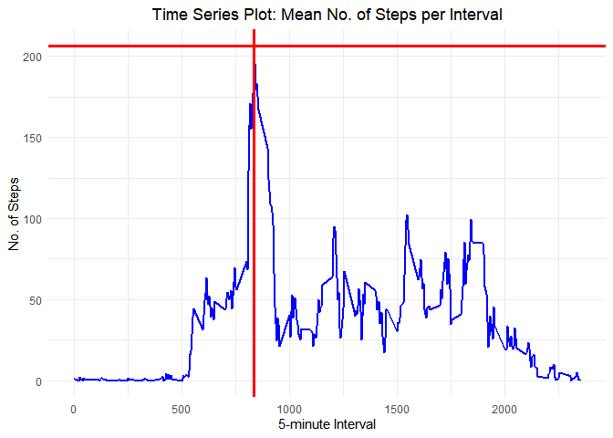
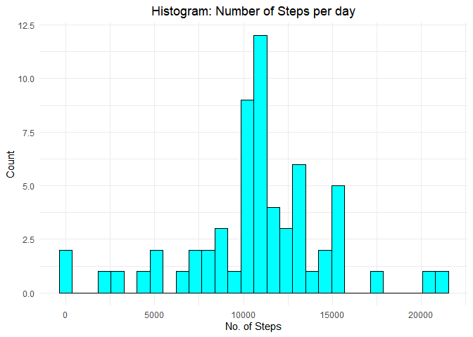
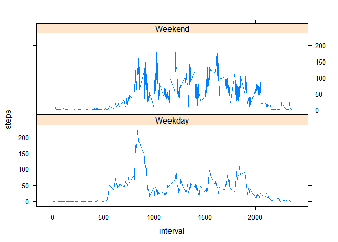

```r
knitr::opts_chunk$set(
    echo = TRUE,
    message = FALSE,
    warning = FALSE,
    results = TRUE,
    cache = TRUE
)
```

## Loading and preprocessing the data

First, we load the required libraries for the task.


```r
library(tidyverse)
library(ggplot2)
```

Next, we load and preprocess the data.


```r
activity_data <- read.csv("activity.csv")
head(activity_data)
```

```
##   steps       date interval
## 1    NA 2012-10-01        0
## 2    NA 2012-10-01        5
## 3    NA 2012-10-01       10
## 4    NA 2012-10-01       15
## 5    NA 2012-10-01       20
## 6    NA 2012-10-01       25
```

## What is mean total number of steps taken per day?

For the total steps taken, we first group our data by summing the total number of steps and grouping by each day.


```r
steps_per_day <- activity_data %>% 
  drop_na(steps) %>% 
  select(date, steps) %>% 
  group_by(date) %>% 
  summarise(steps = sum(steps))
```

Next, we plot the histogram for the no. of steps.


```r
ggplot(data = steps_per_day, 
       mapping = aes(x = steps)) +
  theme_minimal() +
  geom_histogram(colour = "black", fill = "gold") +
  xlab("No. of Steps") +
  ylab("Count") +
  ggtitle("Histogram: Number of Steps per day")+
  theme(plot.title = element_text(hjust = 0.5))
```

<!-- -->

Finally, we calculate the mean and median, and report it in the data frame.


```r
mean_steps <- mean(steps_per_day$steps)
median_steps <- median(steps_per_day$steps)

data.frame(mean_steps, median_steps)
```

```
##   mean_steps median_steps
## 1   10766.19        10765
```

## What is the average daily activity pattern?

First, we take the mean of the no. of steps taken during each interval and store it in a variablel.


```r
steps_per_interval <- activity_data %>% 
  drop_na(steps) %>% 
  select(interval, steps) %>% 
  group_by(interval) %>% 
  summarise(steps = mean(steps))
```

Next, we plot the time series plot for daily activity pattern.


```r
ggplot(data = steps_per_interval,
       mapping = aes(x = interval, y = steps)) +
  theme_minimal() +
  geom_line(color = "blue",
            size = 1.05) +
  geom_vline(xintercept = as.numeric(steps_per_interval %>% 
                                     filter(steps == max(steps)) %>% 
                                     select(interval)),
             color = 'red',
             size = 1.1) +
  geom_hline(yintercept = max(steps_per_interval$steps),
             color = 'red',
             size = 1.1) +
  xlab("5-minute Interval") +
  ylab("No. of Steps") +
  ggtitle("Time Series Plot: Mean No. of Steps per Interval")+
  theme(plot.title = element_text(hjust = 0.5))
```

<!-- -->

For the interval during which the highest number of average steps are taken, the following code snipped calculates that:


```r
max_interval <- as.numeric(steps_per_interval %>% 
                           filter(steps == max(steps)) %>% 
                           select(interval))
max_interval
```

```
## [1] 835
```
Which translates to 08:35 to 08:40.


## Imputing missing values

To calculate the total number of missing values:


```r
miss_vals <- sum(is.na(activity_data))
miss_vals
```

```
## [1] 2304
```
To compensate for the missing values, we substitute the values for the mean we found during the specific interval.


```r
new_data <- merge(activity_data, 
                  steps_per_interval, 
                  by = "interval", 
                  all.x = TRUE) %>% 
  mutate(steps.x = ifelse(is.na(steps.x), steps.y, steps.x)) %>% 
  rename(steps = steps.x) %>% 
  select(steps, date, interval) %>% 
  arrange(date)
```

After imputing the data set, the new dataset is shown below:


```r
head(new_data)
```

```
##       steps       date interval
## 1 1.7169811 2012-10-01        0
## 2 0.3396226 2012-10-01        5
## 3 0.1320755 2012-10-01       10
## 4 0.1509434 2012-10-01       15
## 5 0.0754717 2012-10-01       20
## 6 2.0943396 2012-10-01       25
```

Now we create the histrogram of the new dataset. For histogram, we first create a new variable which contains the summarised data.


```r
steps_per_day_new <- new_data %>%
  select(date, steps) %>% 
  group_by(date) %>% 
  summarise(steps = sum(steps))

ggplot(data = steps_per_day_new, 
       mapping = aes(x = steps)) +
  theme_minimal() +
  geom_histogram(colour = "black", 
                 fill = "cyan") +
  xlab("No. of Steps") +
  ylab("Count") +
  ggtitle("Histogram: Number of Steps per day")+
  theme(plot.title = element_text(hjust = 0.5))
```

<!-- -->
Finally, we calculate the mean and median, and report it in the data frame.


```r
mean_steps_new <- mean(steps_per_day_new$steps)
median_steps_new <- median(steps_per_day_new$steps)
diff_mean <- mean_steps_new - mean_steps
diff_median <- median_steps_new - median_steps

data.frame(mean_steps, diff_mean, median_steps, diff_median)
```

```
##   mean_steps diff_mean median_steps diff_median
## 1   10766.19         0        10765    1.188679
```

From the updated data, we see that there is no difference in mean, because essentially, we have replaced the NA's with means. There is an increase in median, however.


## Are there differences in activity patterns between weekdays and weekends?

To look for difference in activity patterns, we first modify our data set to indicate whether the date falls on the weekday or weekend


```r
days <- with(new_data, weekdays(as.Date(date)))
days_weekend <- c("Saturday", "Sunday")

activity_days <- new_data %>%
  mutate(day = ifelse(days == days_weekend, "Weekend", "Weekday")) %>% 
  mutate(day = as.factor(day))

head(activity_days)
```

```
##       steps       date interval     day
## 1 1.7169811 2012-10-01        0 Weekday
## 2 0.3396226 2012-10-01        5 Weekday
## 3 0.1320755 2012-10-01       10 Weekday
## 4 0.1509434 2012-10-01       15 Weekday
## 5 0.0754717 2012-10-01       20 Weekday
## 6 2.0943396 2012-10-01       25 Weekday
```

Next, we summarise our data for the means.


```r
steps_per_interval_new <- activity_days %>%  
  select(interval, steps, day) %>% 
  group_by(interval, day) %>% 
  summarise(steps = mean(steps))
```

Now, we plot our data using the lattice library.


```r
library(lattice)
xyplot(steps ~ interval | day, data = steps_per_interval_new, 
       type = "l", layout = c(1, 2))
```

<!-- -->

From the activity compartison, difference can be seen in the activites during weekdays and weekends.
